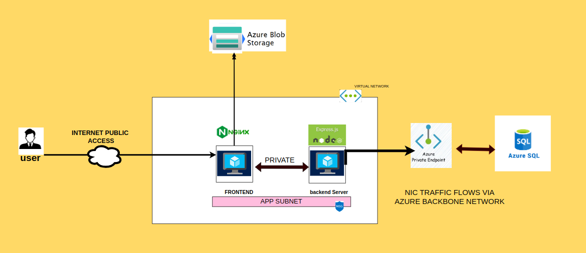
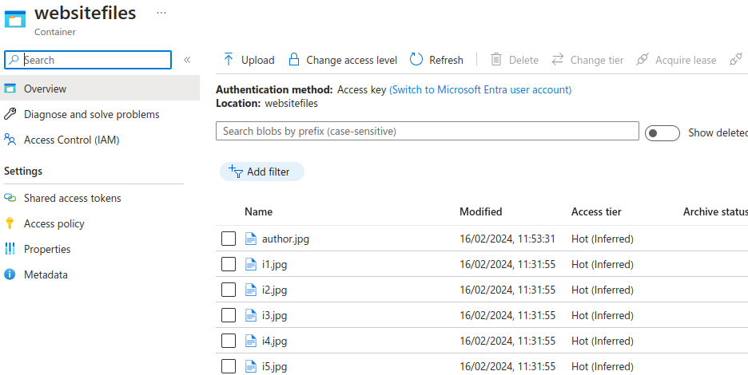

# "AzureTube: Implementing a Secure Three-Tier Architecture for Your YouTube Clone on Azure Cloud"

BACKEND
 - Node Js runtime,
 - express js framework

Database
 - Azure SQL ( PAAS )
 - MSSQL client

FRONTEND
 - HTML, CSS, Javascript
 - Webserver: Nginx

CLOUD: AZURE
 - IAAS : Virtual machines, ubuntu OS disks, NICs associated with public and private Address
 - Virtual Network, subnets, Private Endpoint Link
 - Network security Group (NSG ) Inbound rules
 - Static Files Storage container: Azure blobs

# DESIGN

# WEBAPP:

At the core of the architecture is an Azure SQL Database, serving as the backend data store. structured the tables and populated them with relevant data to support the detailing of the youtube clone

To ensure secure communication and network isolation, Set up a virtual network (VNet1) within Azure. 

Within this virtual network, deployed two virtual machines. The first virtual machine (backendserver) hosts the backend application, serving as the API endpoint for the web application.

it has a private endpoint setup linked to the Azure SQL DB (PAAS)

The second virtual machine (VM2) hosts the frontend application, providing the user interface for the web application. It communicates with the backend API hosted on VM1 to fetch data and present it to users.

 It handles requests from the frontend, interacts with the Azure SQL Database to retrieve and process data, and then sends responses back to the frontend.

The second virtual machine (VM2) hosts the frontend application, providing the user interface for the web application. It communicates with the backend API hosted on VM1 to fetch data and present it to users in a user-friendly manner.

Additionally,  Azure Blob Storage to store image and static files, ensuring efficient storage and retrieval for the web application.

# STEPS

1. Create Azure Account:

 2. Set Up Virtual Network (VNet1):

In Azure portal, navigate to Virtual Networks.
Click "Create" and follow the steps to create VNet1.
Deploy Virtual Machines:

Within VNet1, deploy two virtual machines:
One for the backend application (VM1).
One for the frontend application (VM2).
 
3. Configure Network Security:

Set up network security groups to control traffic within VNet1.
 - allow ssh, tcp 80, tcp 3000

4. Set Up Backend (VM1):

Install necessary software for backend application.

(node, npm, mssql client, express)

Configure the backend application to communicate with Azure SQL Database (using private endpoint).

Ensure backend application is running and accessible within VNet1.

5. Set Up Frontend (VM2):
 
Configure the frontend application to communicate with the backend API hosted on VM1.

Ensure frontend application is running and accessible within VNet1.

nginx service: running

6. Configure Azure SQL Database:

Create a database within Azure SQL.
Set up tables and populate them with relevant data.
Configure private endpoint for secure communication with VM1.

7. Set Up Azure Blob Storage:

Create a storage account within Azure Blob Storage.
Upload static files and images needed for your web application.
Configure access permissions as needed. (anonymous access to blob and containers)

Credits : youtube mockup - https://www.freecodecamp.org/news/how-to-build-a-website-with-html-and-css-step-by-step/
