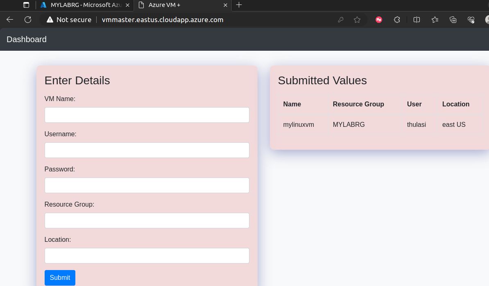

# Design:

 

# webapp UI

# Techstack:

Frontend: HTML, CSS, JavaScript, React.js (optional)

Backend: Node.js, Express.js

Cloud Services: Azure, Azure ARM, Azure CLI

Authentication: Azure Active Directory, Service Principal 
Authentication

# Purpose:

Azure Portal offers a wide range of features beyond VM creation, potentially overwhelming users with unnecessary options. A custom web application ensures users focus solely on VM creation, streamlining their experience.

Organizations may enforce strict resource management policies, confining VM creation to particular resource groups for better organization and cost control. A custom web application can enforce this restriction, ensuring users create VMs only within specified resource groups, enhancing governance.

Custom web applications can provide a more intuitive and user-friendly interface compared to the Azure Portal, especially for users who are not familiar with the complexities of the Azure ecosystem. By presenting a simplified interface tailored specifically for VM creation, users can perform their tasks more efficiently without being overwhelmed by unnecessary features.

# Action items: 

1. setup frontend UI to get details from user
2. setup backend to process the UI requests ( Express app, NODE JS, azure cli)
3. create a Service principle to orchestrate vm creations
4. build the arm template deployment based on the parameter from UI
5. once deployment completed, updated UI to add the created VMS
6. Verify in azure cloud portal - Testing

# Service principle authentication and authorization

1. create a app registration in Entra ID
2. register the app with client secret
3. provide IAM to the app ( subscriptions > IAM > priviledged role to create & manage resources)

## Frontend:

check if the backend is processing the vm creating

check the ARM template response and provisioning state

Validate in Azure portal and ssh the vm 

To host the application from vm instance : (master)

## Frontend:

 - HTML: For structuring the web pages.

 - CSS: For styling the user interface and enhancing user experience.

 - JavaScript: For client-side interactions and form validation.

 - Optionally, a frontend framework like React.js, Vue.js, or Angular.js can be used for building dynamic user interfaces and managing state.

## Backend:

Node.js: A JavaScript runtime environment for executing JavaScript code on the server-side.

Express.js: A web application framework for Node.js that simplifies the process of building APIs and web applications.

npm or yarn: Package managers for managing project dependencies and scripts.

Azure Node.js SDK (azure-arm-compute, ms-rest-azure, etc.): Libraries for interacting with Azure services programmatically from Node.js.

## Authentication and Authorization:

 - Azure Active Directory (Azure AD): For managing identities and securing access to Azure resources.

 - Service Principal: An identity used for non-human authentication, such as applications and services.

## Deployment and Infrastructure:

 - Azure ARM Templates: Declarative JSON templates for deploying Azure resources consistently.

 - Azure CLI: Command-line interface for managing Azure resources, which you'll use for deploying ARM templates and managing VMs.

 - Possibly Docker: If you want to containerize your application for easier deployment and management.

## Development Tools:

Visual Studio Code, Sublime Text, or any preferred code editor for writing code.

Git for version control.

Postman or similar tools for testing API endpoints during development.