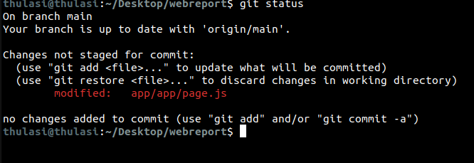
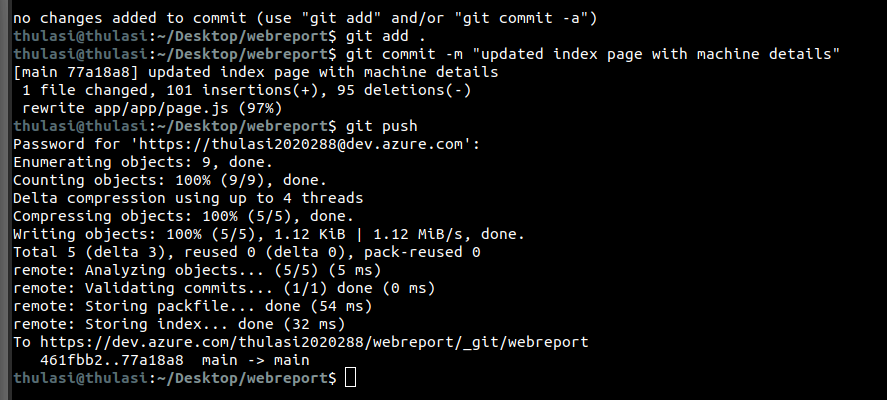
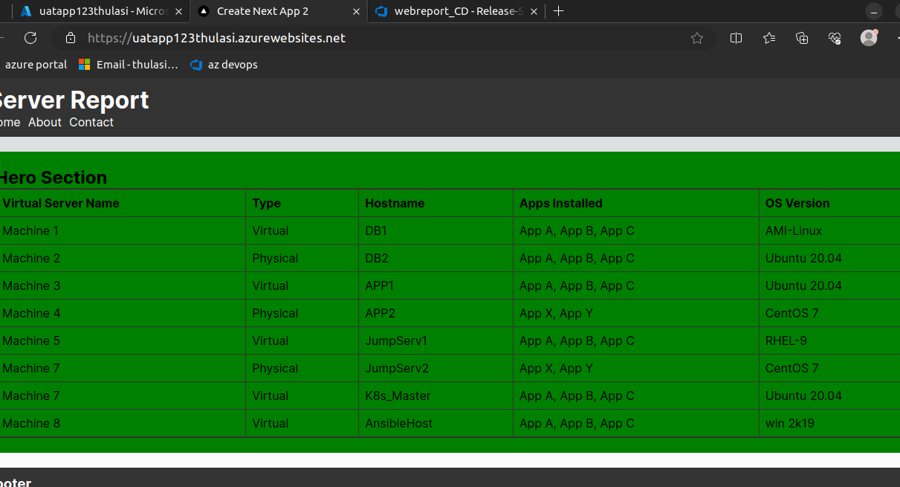

# project demo

# project design

# initialize a next.js app

# authenticate to azure account to select the subscription

# create a azure storage account for terraform backend state management

and 2 separate container blobs for UAT and PROD state file store

initialize the terraform and check if the initial state files are stored in remote backend ( azure storage account - container)

create a containter registry in azure to store docker images

mul

Setup the CI pipeline to checkout the code base and prepare docker build

 and pass the artifacts for release

multi stage docker build strategy to build and run the image with reduced size ( light weight )

verify if the new image is tagged and pushed to azure container registry

create a release pipeline and set the auto-trigger when new image is tagged to acr repository

setup the release stages

 - create UAT and deploy app service
 - verify the webapp status and destroy
 - post deployment approval to promote changes to PROD

verify the changes

commit and test the code locally ( dev server - next.js)

commit and see the CI pipeline action

pipeline is auto-triggered

and release is started when new image tag is added

check if UAT -app service is provisioned by terraform

Verify the UAT app / website and approve it for promotion

