# Demo

# Architecture
 

Python Django:

Django is a high-level web framework written in Python that encourages rapid development and clean, pragmatic design. It provides built-in features for creating web applications, including an ORM (Object-Relational Mapping) for interacting with databases, a URL routing system, a template engine, and a powerful admin interface.
With Django, developers can build web applications quickly by following the "Don't Repeat Yourself" (DRY) principle and using reusable components called apps.
Django follows the Model-View-Template (MVT) architectural pattern, which is similar to the Model-View-Controller (MVC) pattern but with a different organization of components.
Azure Active Directory (Azure AD):

Azure Active Directory is Microsoft's cloud-based identity and access management service. It provides authentication and authorization services for applications hosted on the Azure platform as well as for on-premises resources.
Azure AD enables single sign-on (SSO) for users across various applications and services, allowing users to access multiple resources with a single set of credentials.
It supports various authentication protocols such as OAuth 2.0, OpenID Connect, and SAML, making it compatible with a wide range of applications and platforms.
WSGI (Web Server Gateway Interface):

WSGI is a specification for a standardized interface between web servers and Python web frameworks or applications. It defines how web servers communicate with Python applications and how requests and responses are passed between them.
WSGI allows for interoperability between different web servers (e.g., Nginx, Apache) and Python web frameworks (e.g., Django, Flask). By adhering to the WSGI specification, Python web applications can run on various web servers without modification.
WSGI servers, such as Gunicorn (Green Unicorn) and uWSGI, implement the WSGI interface and are used to serve Python web applications in production environments. These servers handle incoming HTTP requests, invoke the Python application code, and return responses to the client.
Gunicorn (Green Unicorn):

Gunicorn is a popular WSGI HTTP server for Python web applications. It's a pre-fork worker model server, meaning it creates a pool of worker processes to handle incoming requests efficiently.
Gunicorn is designed to be lightweight, reliable, and easy to use. It's often used to deploy Django, Flask, and other Python web applications in production environments.
Gunicorn works by loading the Python application specified in the WSGI format and serving it over HTTP. It can handle multiple concurrent connections and distribute incoming requests among worker processes to maximize performance.
In summary, Python Django is a web framework for building web applications, Azure Active Directory is a cloud-based identity and access management service, WSGI is a standardized interface for Python web applications, and Gunicorn is a WSGI HTTP server commonly used to serve Python web applications like Django.

# ---------------------------------------

Set Up an Azure Virtual Machine:

Log in to the Azure portal.
Create a new virtual machine by selecting the appropriate OS (e.g., Ubuntu, CentOS) and configuring the instance size, authentication method, etc.
Connect to the Virtual Machine:

Once the VM is provisioned, connect to it using SSH (for Linux VMs) or Remote Desktop (for Windows VMs).

Update System Packages:

Run system updates to ensure all packages are up to date. For Ubuntu, you can use sudo apt update && sudo apt upgrade.
Install Required Software:

Install necessary software such as Python, pip, and any other dependencies required for your Django application.
Transfer Django Application Files:

Transfer your Django application files to the VM. You can use tools like SCP, SFTP, or Git to upload your codebase.
Set Up a Virtual Environment:

Create a virtual environment to isolate your Django application's dependencies. Use virtualenv or venv for this purpose.
Install Django and Dependencies:

Activate the virtual environment and install Django and any other Python dependencies using pip.
Configure Database and Static Files:
 
Set Up Gunicorn or uWSGI:

Install and configure a WSGI server like Gunicorn or uWSGI to serve your Django application. Configure it to run your Django application.

# implementation

setup a azure vm to host a django application
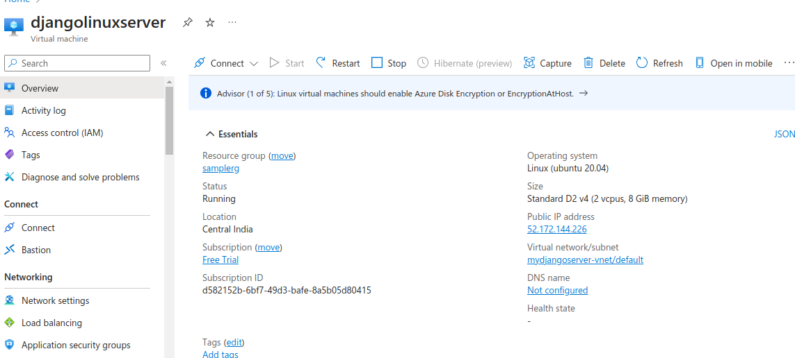

install django and start creating auth package and fronend app

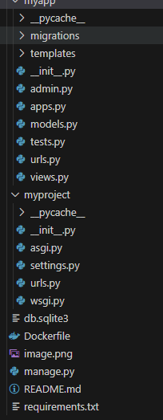
`pip install django`

`pip install django-azure-auth`

setup a app registration in azure entra id - to leverage Identity service
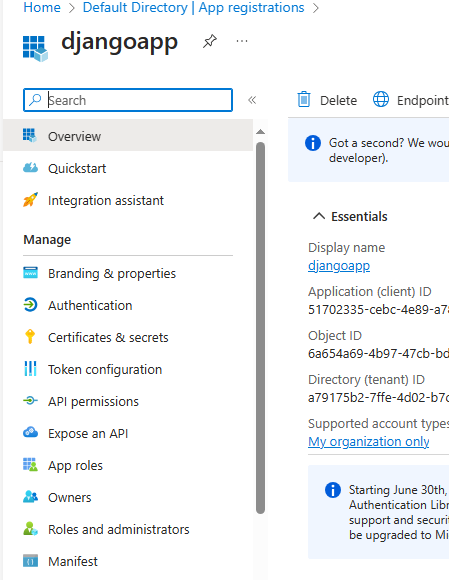

 - create a secret
 -create authentication - web ( redirect URI )

 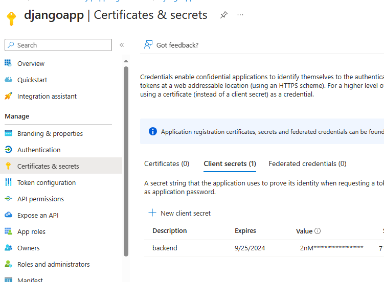
 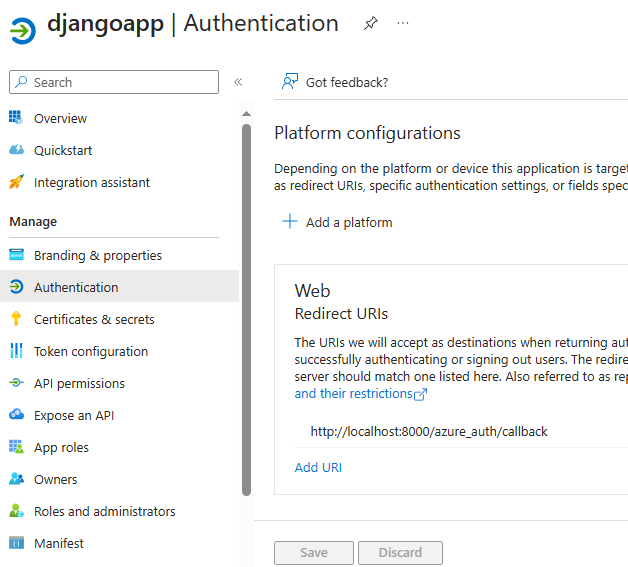
 - create token and validation ( firstname, email, upn...)
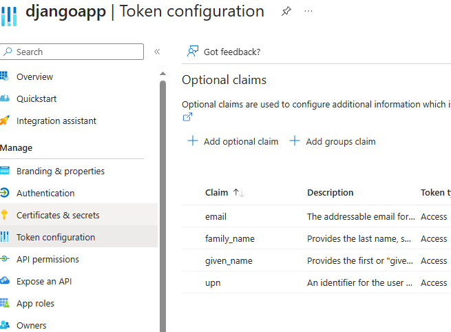

- setup the brand and org notes

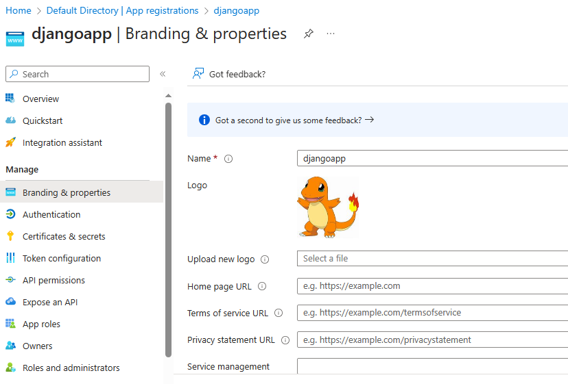

# setup the EntraID user and group level access
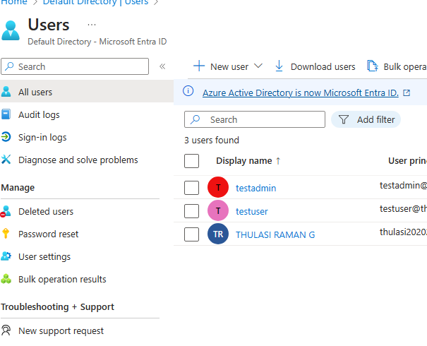
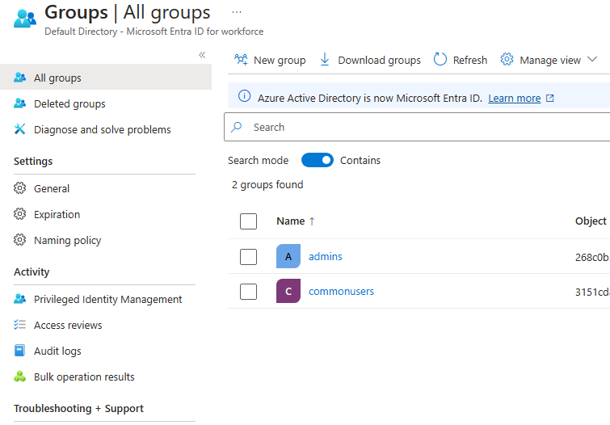
 install azure auth module for python and setup middleware level / protected route authentication

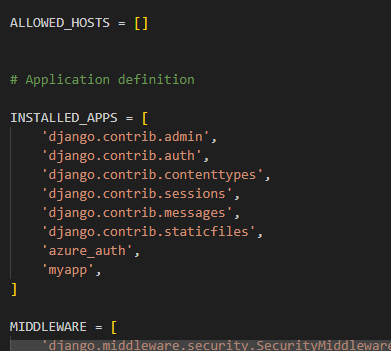

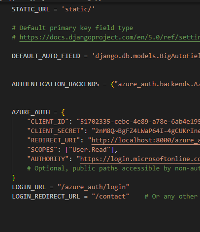

# start the django server and test the application access with common and admin user

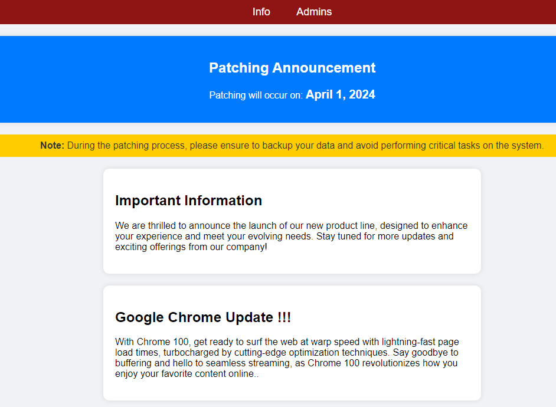

# click INfo ( common user access)

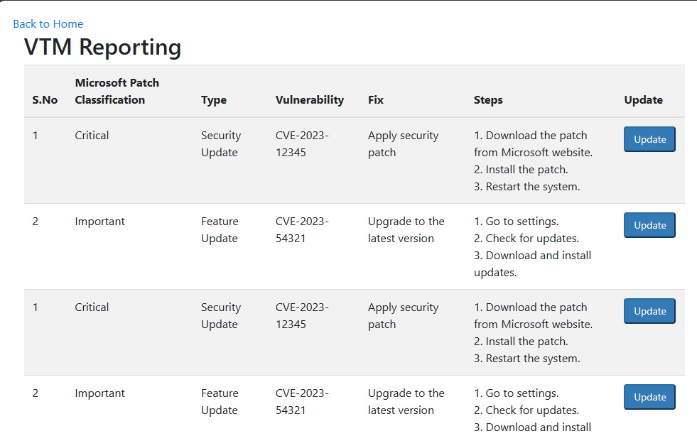

# click admin link ( protected routes)

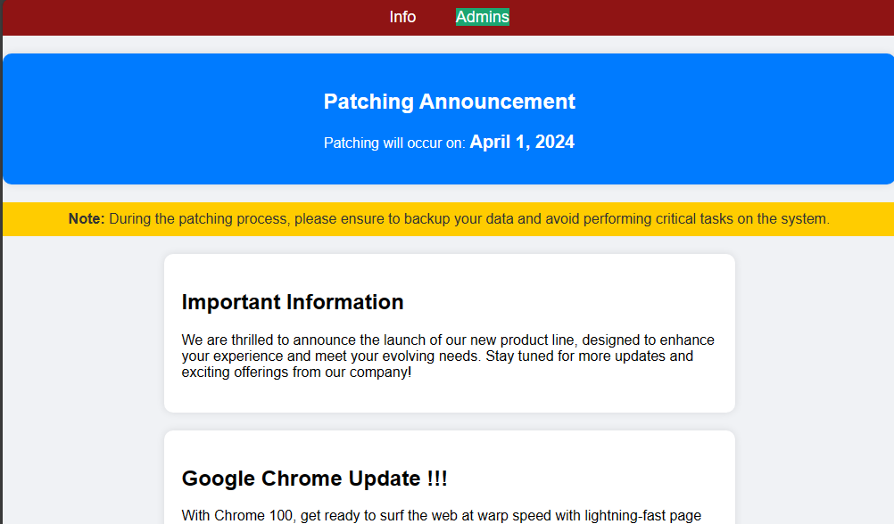

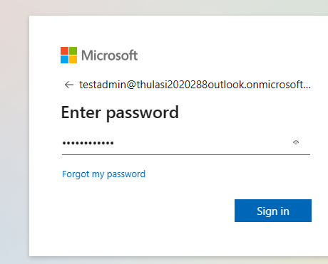

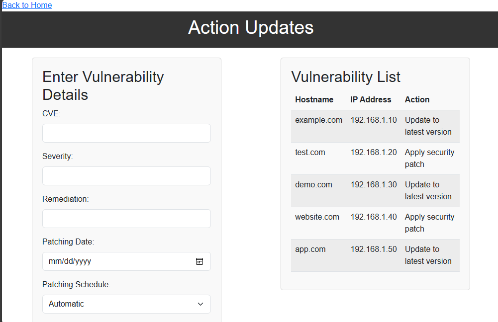

# -unauthorised user
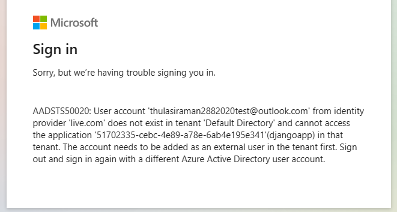

