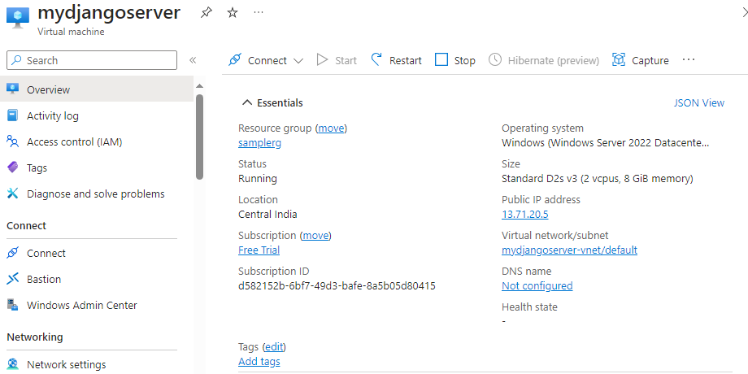

setup a azure vm to host a django application

install django and start creating auth package and fronend app

`pip install django`

`pip install django-azure-auth`

setup a app registration in azure entra id - to leverage Identity service

 - create a secret
 -create authentication - web ( redirect URI )

 
 
 - create token and validation ( firstname, email, upn...)

- setup the brand and org notes

# setup the EntraID user and group level access

 install azure auth module for python and setup middleware level / protected route authentication

start the django server and test the application access with common and admin user

click INfo ( common user access)

click admin link

-unauthorised user

